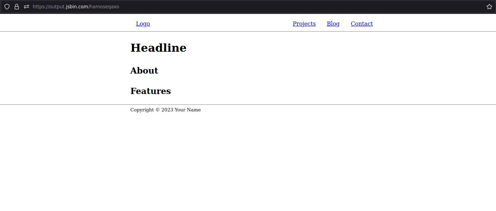

## Prerequisites

To get the most out of this article, you should have a basic understanding of [HTML](https://developer.mozilla.org/en-US/docs/Learn/HTML), [CSS](https://developer.mozilla.org/en-US/docs/Learn/CSS) and [JavaScript](https://developer.mozilla.org/en-US/docs/Learn/JavaScript) as well as some common terms (e.g. accessibility, dependency, deployment, build).

## Static site generators

While you could simply create a few `.html`, `.css` and `.js` files and link them together to create your website, using a Static site generator (SSG) can make things a lot easier.

SSGs make your project a bit more complicated, but you will get used to it quickly and greatly benefit from the many advantages. Here are a few of them:

- Reuse snippets of code with components
- Scoped CSS styles to avoid complex selectors
- Optimizing your code (e.g. minifying CSS or JavaScript) at build time
- Live development server
- File based routing

There are a lot of SSGs out there, and I tried many of them, but the one I liked the most and recommend is [Astro](https://astro.build/). It is actively maintained, has a great documentation and a lot of cool, unique features.

## Semantic HTML

Using the right HTML element for the right job makes your website more accessible, SEO friendly and can also make your life easier, so it makes a lot of sense to learn when to use which element. 

### Page structure

To get started with the general layout of your page(s), you can use the following template:

```html
<body>
  <nav>
    <div class="container">
      <a href="/">Logo</a>
      <ul>
        <li>
          <a href="/projects">Projects</a>
        </li>
        <li>
          <a href="/blog">Blog</a>
        </li>
        <li>
          <a href="/contact">Contact</a>
        </li>
      </ul>
    </div>
  </nav>
  <header>
    <div class="container">
      <h1>Headline</h1>
    </div>
  </header>
  <main>
    <div class="container">
      <section id="about">
        <h2>About</h2>
        <!-- ... -->
      </section>
      <section id="features">
        <h2>Features</h2>
        <!-- ... -->
      </section>
    </div>
  </main>
  <footer>
    <div class="container">
      <small>Copyright © 2023 Your Name</small>
    </div>
  </footer>
</body>
```

### Semantic elements

- [address](https://developer.mozilla.org/en-US/docs/Web/HTML/Element/address)
- [article](https://developer.mozilla.org/en-US/docs/Web/HTML/Element/article)
- [blockquote](https://developer.mozilla.org/en-US/docs/Web/HTML/Element/blockquote)
- [details](https://developer.mozilla.org/en-US/docs/Web/HTML/Element/details)
- [dialog](https://developer.mozilla.org/en-US/docs/Web/HTML/Element/dialog)
- [fieldset](https://developer.mozilla.org/en-US/docs/Web/HTML/Element/fieldset)
- [figure](https://developer.mozilla.org/en-US/docs/Web/HTML/Element/figure)
- [section](https://developer.mozilla.org/en-US/docs/Web/HTML/Element/section)
- [time](https://developer.mozilla.org/en-US/docs/Web/HTML/Element/time)

Of course there are many more, the elements listed above are just some of the ones I used a few times. Navigate to the [MDN HTML elements reference](https://developer.mozilla.org/en-US/docs/Web/HTML/Element) for a well structured overview of all the elements.

## Accessible styles

While styling your elements with CSS, you should also keep accessibility in mind. Here are some simple guidelines:

- `font-size` should be at least `16px` and `line-height` `1.5` or `1.6`  for good readability. Another improvement would be to limit the `width` of text to `70ch`.
- Color contrasts are important, do not put dark gray text on a black background
- Pay attention to responsiveness, so your website is usable on any screen size
- Interactive elements, such as `<button>` or `<a>` should have a large tap area for mobile users

After applying the styles shown above and some more simple ones to the [HTML page template](#page-structure):

```css
body {
  line-height: 1.6;
}

nav {
  border-block-end: 0.0625rem solid hsl(0 0% 50%);
}

nav > .container, nav ul {
  display: flex;
  flex-wrap: wrap;
  align-items: center;
}

nav .container {
  justify-content: space-between;
}

nav ul {
  list-style: none;
  margin: 0;
  padding: 0;
}

.container {
  max-inline-size: 70ch;
  margin-inline: auto;
}

a {
  display: inline-block;
  padding-inline: 1rem;
  padding-block: 0.5rem;
}

footer {
  border-block-start: 0.0625rem solid hsl(0 0% 50%);
}
```

we have an accessible, and solid looking website:



## Performance 

When using a SSG, you basically do not have to do anything here. At build time, many optimizations are performed to make the production website as fast as possible.

With Astro you can even use a special `src/assets` directory where all your stored images are optimized in. The photos on my [gallery](https://thilohohlt.com/gallery) page rely on this mechanism. Each of them becomes up to **ten times** smaller in file size.


## Search engine optimization

SEO is a big topic, there is a lot to it. I recommend going through the [Google SEO starter guide](https://developers.google.com/search/docs/fundamentals/seo-starter-guide?hl=en&visit_id=638190130030783607-1110661193&rd=1) to pick up the most important information. Following the patterns shown in that article should get you really far.

## Publishing your website

Being able to only access your website from your own computer is boring, is it not? Fortunately you have plenty of options for bringing your site online and thus making it accessible to anyone on the internet.

My favorite way to automate this process is to use [Git](https://git-scm.com/), [GitHub](https://github.com/) and [Cloudflare Pages](https://pages.cloudflare.com/). Besides Cloudflare Pages, I also highly recommend [Netlify](https://www.netlify.com/) or [Vercel](https://vercel.com/).

There are wonderful [recipes on how to deploy your website](https://docs.astro.build/en/guides/deploy/) for different hosting platforms in the Astro documentation, so I will not try to replicate them here.

In case you are not using a SSG, you can follow the [Cloudflare Pages deployment guide](https://developers.cloudflare.com/pages/framework-guides/deploy-anything/).

## Conclusion

I hope this article helped you to create an accessible and performant modern website. There is also a section in my resources page which lists multiple [useful tools for building websites and web applications](https://thilohohlt.com/resources/#build-modern-websites-and-web-applications).